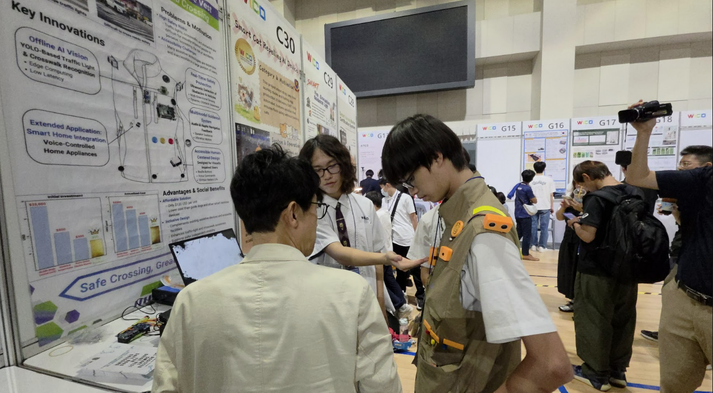
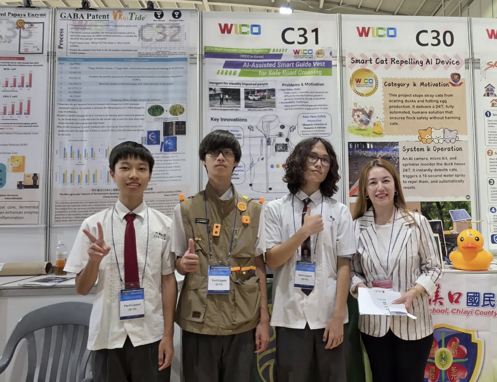
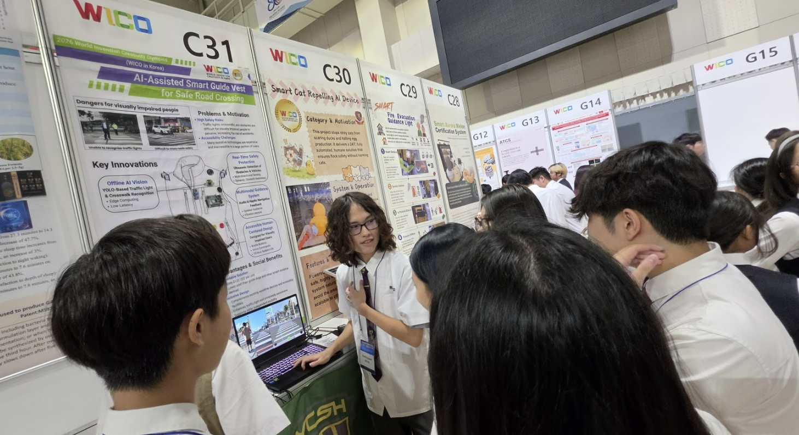
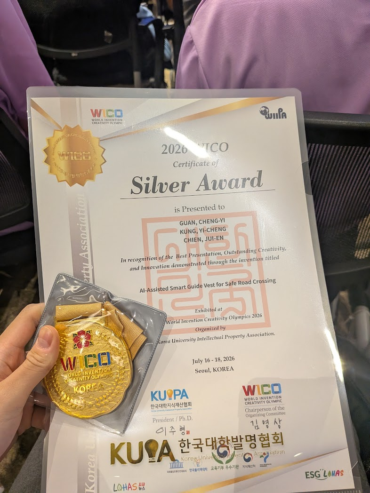
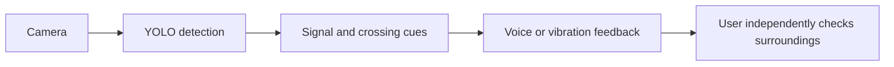

# AI-Assisted Smart Guide Vest 1

**Exploring camera-based cues for safer, more accessible street crossings.**

[Latest project release · v1.0.1](https://github.com/xlistenz/AI-Assisted-Smart-Guide-Vest/releases/latest) · 2026 TEYI Silver Award · 2026 WICO Silver Award

[Traditional Chinese](README.zh-TW.md) · [Competition photos](docs/competitions.md) · [Hardware list](hardware/BOM.md) · [Dataset notes](dataset/README.md)

> [!WARNING]
> This is an experimental research prototype, not a certified mobility aid. It cannot guarantee correct signal detection or safe crossing. Always check the real signal and traffic using independent judgment and appropriate support.

## Project at a glance

| | |
| --- | --- |
| **Purpose** | Explore camera-based traffic-signal and crosswalk cues for visually impaired pedestrians. |
| **Prototype** | Raspberry Pi / Picamera2, YOLO inference, GPIO indicators, vibration outputs, and voice-module triggers. |
| **Recognition** | Silver Awards at the 2026 TEYI Taiwan Selection and 2026 WICO. |
| **Current stage** | Physical prototype and competition demonstration; hardware, model mapping, and field safety still need validation. |

## Awards and prototype gallery

The awards and event demonstrations show the project's early promise and the feasibility of building and presenting a physical assistive-technology prototype. They do not establish real-world reliability or safety. See the [competition record](docs/competitions.md) for context and references.

<table>
  <tr>
    <td align="center"><br><sub>Wearable prototype demonstration</sub></td>
    <td align="center"><br><sub>Project team at the exhibition booth</sub></td>
  </tr>
  <tr>
    <td align="center"><br><sub>Project display at WICO</sub></td>
    <td align="center"><br><sub>2026 WICO Silver Award</sub></td>
  </tr>
</table>

## Project status

- **Source:** [`src/main.py`](src/main.py) contains camera capture, YOLO inference, GPIO controls, and voice-module triggers. It has not been validated on the complete vest or on a Raspberry Pi.
- **Model:** [`models/my_model.pt`](models/my_model.pt) is a YOLO11s checkpoint. Supplied training records report 640-pixel input and 80 epochs; its class mapping has not been verified.
- **Labels:** The target specification has five classes, while the available dataset exports contain only three generic classes with conflicting orders. They do not distinguish pedestrian signals from vehicle lights.
- **Hardware:** Physical wiring and motor-driver details still need verification. The software's BCM pin assignments are not wiring instructions.

## Intended workflow

This diagram describes the design concept, not a verified safety system.



The current program does not provide route navigation or Google Speech/Maps integration. See [architecture](docs/architecture.md) and [workflow notes](docs/workflow.md) for what is present in the source.

## Hardware and software

The design brief names a Raspberry Pi 5, Camera Module 3, GPIO, vibration motors, and audio output. The competition checklist includes additional display, ultrasonic, voice-module, and repair materials; their presence on the list does not confirm installation in the vest. See the [hardware list](hardware/BOM.md), [wiring notes](hardware/wiring.md), and [GPIO pinout](hardware/pinout.md).

The program uses Picamera2, OpenCV, NumPy, Ultralytics YOLO, and RPi.GPIO. Raspberry Pi camera and GPIO libraries must be installed for the target operating system. The default model path is `models/my_model.pt`; set `MODEL_PATH` to override it.

```bash
python -m venv .venv
source .venv/bin/activate
python -m pip install -r requirements.txt
python src/main.py
```

This launch procedure is based on source inspection and has not been tested on target hardware. Review the [installation guide](docs/installation.md) and [safety notes](docs/safety.md) before use.

## Datasets

The two selected source archives are published in the [v0.1.0 dataset release](https://github.com/xlistenz/AI-Assisted-Smart-Guide-Vest/releases/tag/v0.1.0). The larger 2.68 GB export is split into two parts; the 199 MB export is a single file. Download links, SHA-256 checksums, reconstruction steps, and audit findings are in [`dataset/README.md`](dataset/README.md).

To reassemble the larger archive after downloading both parts:

```bash
python scripts/join_release_parts.py --output data.zip data.zip.part01 data.zip.part02
```

Neither export is a ready-to-train five-class dataset. Their train/validation/test splits and redistribution terms are not documented. See [`dataset/classes.txt`](dataset/classes.txt), [`dataset/data.yaml`](dataset/data.yaml), and the [dataset audit](dataset/README.md).

## Safety and licensing

Lighting, weather, occlusion, camera angle, and traffic conditions can cause missed or incorrect detections. Never rely on this prototype as the sole basis for crossing. Hardware integration and field safety have not been validated.

The MIT license applies to original project code and documentation only. Redistribution terms for third-party dataset archives, model weights, and photographs have not been independently established; see the [model notes](models/README.md) and [asset notes](assets/README.md).

## Documentation

- [Competition awards and photos](docs/competitions.md)
- [Hardware bill of materials](hardware/BOM.md)
- [Dataset status and downloads](dataset/README.md)
- [Installation](docs/installation.md) · [Troubleshooting](docs/troubleshooting.md) · [Safety](docs/safety.md)
- [Contributing](CONTRIBUTING.md) · [Development notes](docs/development.md) · [References](docs/references.md)
- [Changelog](CHANGELOG.md)
