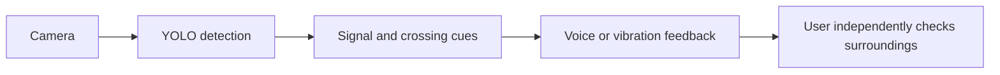

# AI-Assisted Smart Guide Vest

An experimental computer-vision project exploring camera-based cues for visually impaired pedestrians. The repository contains a Raspberry Pi/Picamera2 prototype, YOLO model weights and training artifacts, two original dataset exports, and project documentation.

**This is a research prototype, not a certified mobility aid. It cannot guarantee correct signal detection or safe crossing. Always use independent judgment and established pedestrian-safety practices.**

[Traditional Chinese README](README.zh-TW.md) · [Hardware bill of materials](hardware/BOM.md) · [Safety notes](docs/safety.md) · [Dataset status](dataset/README.md)

## Project status

- Prototype source: [`src/main.py`](src/main.py). Static inspection shows camera capture, YOLO inference, GPIO controls, and voice-module triggers. It has not been validated on the complete vest or on a Raspberry Pi.
- Model: [`models/my_model.pt`](models/my_model.pt). Training records indicate YOLO11s, 640-pixel input, and 80 epochs. Its class mapping has not been verified.
- Target classes: zebra crossing, pedestrian red, pedestrian green, vehicle red, vehicle green. Existing dataset exports contain only three generic classes with inconsistent ordering, and do not distinguish pedestrian signals from vehicle lights.
- Physical wiring and motor-driver details still need verification. Event photos document the wearable prototype and exhibition; they are not evidence of validated performance. See the project notes before assembling or relying on the device.

## Competition awards and prototype photos

The project received Silver Awards at **2026 TEYI** and **2026 WICO (World Invention Creativity Olympic)**. The awards and event demonstrations show that the team built and presented a physical assistive-technology prototype, supporting its early-stage feasibility and potential. They do not certify the system or establish that it is safe for independent street crossing.

See the [competition record and photo gallery](docs/competitions.md).


## Concept



This diagram describes the intended workflow, not a validated safety system. The current program does not provide route navigation or Google Speech/Maps integration.

## Hardware and software

The design direction names a Raspberry Pi 5, Camera Module 3, GPIO, vibration motors, and audio output. The competition checklist also includes additional display, ultrasonic, voice-module, and repair materials; their presence on the list does not confirm installation in the vest. See [`hardware/BOM.md`](hardware/BOM.md), [`hardware/wiring.md`](hardware/wiring.md), and [`hardware/pinout.md`](hardware/pinout.md).

The program uses Picamera2, OpenCV, NumPy, Ultralytics YOLO, and RPi.GPIO. Raspberry Pi camera and GPIO libraries must be installed for the target operating system. The default model path is `models/my_model.pt`; set `MODEL_PATH` to override it.

```bash
python -m venv .venv
source .venv/bin/activate
python -m pip install -r requirements.txt
python src/main.py
```

This launch procedure is based on source inspection and has not been tested on target hardware. Review [`docs/safety.md`](docs/safety.md) and [`docs/installation.md`](docs/installation.md) first.

## Datasets

The two selected source ZIPs are distributed as GitHub Release assets: the 2.68 GB export is split into two parts, and the 199 MB export is a single asset. Download links, SHA-256 checksums, reconstruction steps, and audit findings are in [`dataset/README.md`](dataset/README.md). To reassemble the larger archive:

```bash
python scripts/join_release_parts.py --output data.zip data.zip.part01 data.zip.part02
```

The exports lack documented train/validation/test splits and redistribution licenses. Their three-class labels do not match the five-class target. Do not treat them as a ready-to-train five-class dataset. See [`dataset/classes.txt`](dataset/classes.txt) and [`dataset/data.yaml`](dataset/data.yaml).

## Safety and licensing

Lighting, weather, occlusion, camera angle, and traffic conditions can cause missed or incorrect detections. Never rely on this prototype as the sole basis for crossing. Dataset, image, and model provenance or redistribution terms have not been confirmed; the MIT license in this repository applies only to original project code and documentation, not automatically to those assets.

## Contributing

See [`CONTRIBUTING.md`](CONTRIBUTING.md) and [`docs/development.md`](docs/development.md). Check [`docs/references.md`](docs/references.md) for source tutorial links and [`CHANGELOG.md`](CHANGELOG.md) for project history.
